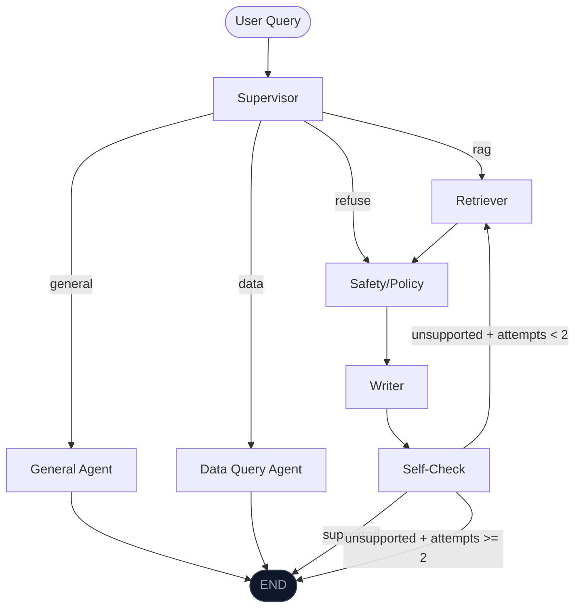

# Órbita — Architecture

## 1. Executive Summary

Órbita is an **agentic financial assistant** for Brazilian young adults (under 35) built as an academic proof of concept. It combines a **multi-agent LangGraph system**, a **RAG pipeline** over official Brazilian financial education materials, and **Open Finance Brasil data** via Pluggy to deliver goal-aware, citation-verified guidance — entirely locally, with no SaaS dependencies and no API cost.

The key architectural thesis: a supervisor-delegated multi-agent system with 4 intent routes, Self-RAG anti-hallucination validation, and MCP-secured personal data access can replace passive financial dashboards with an assistant that knows both what the literature says and what the user's bank account shows.

---

## 2. High-Level Architecture

### 2.1 Pattern

**Multi-Agent State Machine** using LangGraph's `StateGraph`. A central Supervisor agent classifies every user query into one of four routes and delegates to specialized agents. Each agent is a pure node function that receives and returns `OrbitaState` — a single typed `TypedDict` shared across the entire graph.

### 2.2 Agent Inventory

| Agent | Route | Responsibility |
|---|---|---|
| **Supervisor** | Entry | Classifies intent: `general` / `rag` / `data` / `refuse`. Keyword fast-path + LLM fallback. |
| **General** | `general` | Direct Ollama call for conversational/casual questions. No retrieval overhead. |
| **Data Query** | `data` | Fetches current-month transactions + balances via MCP. Builds context block. LLM answers from real user data. |
| **Retriever** | `rag` | FAISS dense search (top-5). Optional `bge-reranker-v2-m3` cross-encoder reranking (top-3). Tracks `retrieval_attempts` for retry loop. |
| **Safety/Policy** | `rag` | Mandatory disclaimer injection. Regex blocklist for regulated advisory topics (specific tickers, portfolio allocation, tax strategies). Sets `is_blocked` if triggered. |
| **Writer** | `rag` | Generates citation-formatted response: every claim mapped to `[Fonte: X, p.Y]`. Populates `citations` list from chunk metadata. |
| **Self-Check** | `rag` | Self-RAG loop: LLM validates each claim against retrieved docs. If unsupported and `retrieval_attempts < 2`: re-retrieves. If still unsupported: sets `final_response` to refusal. |
| **Automation** | `automation` | Three sub-workflows triggered from Streamlit: categorize expenses, detect goal deviation, generate financial report. All call MCP for live data. |

### 2.3 Graph Topology



The graph compiles to a `CompiledGraph` via `build_graph()` and is loaded once into `st.session_state` on first Streamlit render.

---

## 3. Data Flows

### 3.1 General Route (casual chat)

```
User → Supervisor (keyword: "olá", "como você funciona?", none of the other patterns)
  → General: ChatOllama(llama3.1:8b) with system prompt
  → final_response → Streamlit
```

Latency: ~3–8s (single LLM call).

### 3.2 RAG Route (financial education)

```
User → Supervisor (keyword: "o que é", "como funciona", book/concept keywords)
  → Retriever: bge-m3.encode(query) → FAISS.search(k=5) → optional rerank(k=3)
  → Safety: blocklist check + disclaimer injection
  → Writer: LLM with context=[doc1..doc3] + "cite every claim as [Fonte: X, p.Y]"
  → Self-Check: LLM validates {claim: supported?} for each sentence
      ├── all supported → final_response → Streamlit
      └── unsupported + retries < 2 → reformulate query → Retriever (loop)
      └── unsupported + retries >= 2 → refusal message → Streamlit
```

Latency: ~15–30s (2–3 LLM calls + FAISS lookup).

### 3.3 Data Route (personal financial questions)

```
User → Supervisor (keyword: "meu saldo", "meus gastos", "quanto gastei")
  → Data Query:
      MCPClient.get_transactions(month_start, today)   → list[Dict]
      MCPClient.get_balances()                         → list[Dict]
      builds context: "Saldo total: R$X. Receitas: R$Y. Despesas: R$Z. Top 5 transactions..."
  → LLM with context + user_query (system: "use ONLY the data provided")
  → final_response → Streamlit
```

Latency: ~5–15s (Pluggy API call + single LLM call).

### 3.4 Document Ingestion (offline, run once)

```
ingest/sources.yaml (URLs + metadata)
  → loaders.py: load_pdf(url) | load_html(url) | load_synthetic_corpus()
  → splitter.py: RecursiveCharacterTextSplitter(chunk_size=512, chunk_overlap=50)
  → metadata attached: {source_url, title, page_number, section_title}
  → bge-m3 embeddings (1024-dim)
  → FAISS.save_local("data/faiss_index/")
```

Corpus: BACEN Cidadania Financeira, CVM educational materials, Procon-SP/IDEC guides, B3 educational content, *Pai Rico Pai Pobre*, *O Homem Mais Rico da Babilônia*.

### 3.5 Open Finance Data Flow

```
User (Streamlit "Conectar Banco" page)
  → app/pages/connect.py: POST /connect_token → Pluggy API → accessToken
  → Connect Widget (cdn.pluggy.ai/connect/v2) renders in-app
  → User authenticates with bank (or Pluggy Bank sandbox: user_good/password_good)
  → onSuccess: item_id captured → saved to .env → cache cleared

Runtime (any data page or Data Query agent):
  → PluggyDirectClient._auth_header(): POST /auth → JWT (auto-refreshed, 1h45m TTL)
  → GET /accounts?itemId={item_id} → accounts list
  → GET /transactions?accountId={id}&from=...&to=...&pageSize=500 → paginated transactions
  → sanitize_mcp_output() → strips control chars, truncates long fields
  → enforce_allowlist() → PermissionError if tool not in mcp_allowlist.yaml
  → audit_log() → appends JSON line to logs/mcp_audit.log (no financial values)
```

### 3.6 Webhook Flow (real-time event notifications)

```
Pluggy → POST https://<public-url>/webhook
  → src/webhook/server.py (FastAPI, port 8000)
  → verify HMAC-SHA256 signature (if PLUGGY_WEBHOOK_SECRET set)
  → log event to logs/webhook_events.jsonl
  → write logs/cache_bust.txt (triggers Streamlit cache invalidation)

Registered events: item/created, item/updated, transactions/created,
                   transactions/updated, transactions/deleted
Public exposure: ngrok http 8000 (or any tunnel/deployment)
Registration: uv run python -m src.webhook.register --url https://<public-url>/webhook
```

---

## 4. Component Detail

### 4.1 State

`OrbitaState` (TypedDict, `src/graph/state.py`):

```python
class OrbitaState(TypedDict):
    user_query: str
    intent: Optional[Literal["general", "rag", "data", "refuse"]]
    retrieved_docs: list[Document]
    retrieval_attempts: int
    draft_response: Optional[str]
    citations: list[dict]            # [{source, page, passage, url}]
    self_check_passed: bool
    unsupported_claims: list[str]
    disclaimers: list[str]
    is_blocked: bool
    block_reason: Optional[str]
    automation_type: Optional[Literal["categorize", "goal_alert", "report"]]
    automation_input: Optional[dict]
    automation_output: Optional[dict]
    mcp_tool_calls: list[dict]       # Audit trail
    final_response: str
```

### 4.2 MCP Security Layer

All Pluggy data access passes through `PluggyTools` (`src/mcp/pluggy_tools.py`) which wraps `PluggyDirectClient`:

| Control | Implementation |
|---|---|
| **Allowlist** | `mcp_allowlist.yaml` — only `get_transactions`, `get_balances`, `get_accounts` |
| **No writes** | Allowlist blocks all create, update, delete, transfer, payment operations |
| **Audit log** | Every call appended to `logs/mcp_audit.log` as JSON line with timestamp, tool, params (no values), record count |
| **Output sanitization** | Control chars stripped; string fields truncated to 256 chars; financial amounts never logged |
| **Prompt injection guard** | Structured dict output, not raw text; system prompt boundaries hardened |

### 4.3 RAG Corpus

| Source | Type | Topics |
|---|---|---|
| BACEN Cidadania Financeira | PDF + HTML | Banking basics, credit, savings, FGTS, seguro-desemprego |
| CVM Investidor | HTML | Capital markets intro, funds, renda fixa/variável |
| Procon-SP / IDEC | HTML | Consumer rights, banking disputes |
| B3 Educacional | HTML | Exchange mechanics, basic investing |
| *Pai Rico, Pai Pobre* | PDF | Mindset, assets vs. liabilities |
| *O Homem Mais Rico da Babilônia* | PDF | Savings discipline, financial principles |

Chunking: 512 tokens, 50-token overlap, metadata attached per chunk.

### 4.4 Streamlit Dashboard (9 pages)

| Page | Key Content |
|---|---|
| **Dashboard** | KPI cards (balance, income, expenses, net), monthly bar chart, spending donut, balance line chart, recent transactions |
| **Transactions** | Full filterable list with search, category multiselect, income/expense toggle |
| **Cash Flow** | Monthly income vs. expense grouped bar, cumulative area chart, savings rate KPI |
| **Accounts** | Per-account balance cards, total patrimony banner |
| **Assets** | Net worth donut by account type, progress bars, manual asset entry form |
| **Recurring** | Auto-detected recurring charges from 6-month history, average amount, last seen date |
| **Categories** | Horizontal bar + donut, per-category detail with transaction drill-down |
| **Chat (AI)** | Multi-route chat with route badge (📊 Data / 📚 RAG / 💬 General), citation expanders, disclaimer banner, suggestion chips |
| **Connect Bank** | Pluggy Connect Widget embedded via `st.components.v1.html`, connect token auto-generated, item_id saved to `.env` on success |

All financial data pages use `@st.cache_data(ttl=300)` (5-minute cache) on Pluggy API calls. A `cache_bust.txt` written by the webhook server triggers cache invalidation on next load.

---

## 5. Technical Stack

| Layer | Technology | Version | Notes |
|---|---|---|---|
| Language | Python | 3.11+ | |
| Agent orchestration | LangGraph | ≥0.2 | `StateGraph`, typed state, conditional edges |
| LLM chains | LangChain | ≥0.3 | Document loaders, prompt templates, output parsers |
| LLM runtime | Ollama (local) | latest | `llama3.1:8b` primary, `qwen2.5:7b` fallback |
| Embeddings | BAAI/bge-m3 | via sentence-transformers | 1024-dim, multilingual, Portuguese-native |
| Optional reranker | BAAI/bge-reranker-v2-m3 | via sentence-transformers | Cross-encoder; off by default (`ENABLE_RERANKER=false`) |
| Vector store | FAISS | faiss-cpu | Local persistence, zero SaaS |
| Open Finance | Pluggy REST API | pluggy-sdk 1.0+ | Direct REST via `httpx`; Connect Widget for onboarding |
| MCP adapter | langchain-mcp-adapters | ≥0.1 | `PluggyTools` wraps `PluggyDirectClient` |
| MCP server (optional) | FastMCP | mcp ≥1.0 | `src/mcp/pluggy_server.py` — for academic MCP requirement |
| Webhook server | FastAPI + uvicorn | fastapi ≥0.135 | Receives Pluggy event notifications |
| UI | Streamlit | ≥1.30 | 9-page app with Plotly charts, custom dark CSS |
| Charts | Plotly | ≥6.6 | Express + Graph Objects |
| Document loaders | PyPDF + BeautifulSoup4 | pypdf ≥4.0 | PDF and HTML corpus ingestion |
| Evaluation | RAGAS | ≥0.2 | Faithfulness, Relevancy, Precision, Recall |
| Testing | pytest | ≥8.0 | Fully mocked, no external deps required |
| Dependency manager | uv | latest | `pyproject.toml` with `hatchling` build backend |
| Containerization | Docker + Compose | — | Multi-stage build; Ollama as sidecar service |

### Technology Choices Rationale

| Choice | Why |
|---|---|
| **LangGraph over plain LangChain agents** | Explicit typed state, deterministic conditional edges, and retry loop control are essential for the Self-RAG pattern and safe financial routing. ReAct agents lack this flow determinism. |
| **FAISS over Chroma** | Zero client-server overhead, single-file persistence, better throughput for the ~1K–10K chunk corpus size. |
| **Ollama over API LLMs** | Zero cost, full data sovereignty — user financial data never leaves the machine. Critical for a fintech PoC. |
| **bge-m3** | State-of-the-art multilingual dense retrieval with native Portuguese support; 1024-dim vectors give high recall on Brazilian financial terminology. |
| **PluggyDirectClient over SSE MCP transport** | Eliminates the two-process architecture. Same security controls (allowlist, audit log, sanitization) apply through `PluggyTools`. The `pluggy_server.py` is kept for the academic MCP requirement but not required for runtime. |
| **FastAPI webhook server** | Required for Pluggy production access approval and real-time cache invalidation. Runs as a separate process alongside Streamlit. |

---

## 6. Project Structure

```
orbita/
├── README.md
├── ARCHITECTURE.md              ← this file
├── VALUE_PROPOSITION.md
├── IMPLEMENTATION_INSTRUCTIONS.md
├── LICENSE                      (MIT)
├── CITATION.cff
├── Dockerfile
├── docker-compose.yml
├── pyproject.toml               (uv / hatchling)
├── .env.example
├── mcp_allowlist.yaml
│
├── src/
│   ├── config.py                (centralised settings from .env)
│   ├── agents/
│   │   ├── supervisor.py        (4-route intent classifier)
│   │   ├── general.py           (direct LLM, no retrieval)
│   │   ├── data_query.py        (MCP → LLM personal data answers)
│   │   ├── retriever.py         (FAISS + optional rerank)
│   │   ├── safety.py            (disclaimers, blocklist)
│   │   ├── writer.py            (citation-formatted generation)
│   │   ├── self_check.py        (Self-RAG claim validation)
│   │   └── automation.py        (categorize / goal_alert / report)
│   ├── graph/
│   │   ├── state.py             (OrbitaState TypedDict)
│   │   └── builder.py           (StateGraph → CompiledGraph)
│   ├── mcp/
│   │   ├── client.py            (MCPClient: mock or real)
│   │   ├── pluggy_direct.py     (PluggyDirectClient — REST via httpx)
│   │   ├── pluggy_tools.py      (allowlist enforcement + sanitization)
│   │   ├── pluggy_server.py     (FastMCP server — academic requirement)
│   │   ├── mock_server.py       (synthetic data, MCP_MOCK=true)
│   │   └── security.py          (audit logging)
│   ├── rag/
│   │   ├── embeddings.py        (bge-m3 singleton)
│   │   ├── vectorstore.py       (FAISS load/save/search)
│   │   └── reranker.py          (bge-reranker-v2-m3, optional)
│   └── webhook/
│       ├── server.py            (FastAPI webhook receiver)
│       └── register.py          (register webhooks with Pluggy API)
│
├── app/
│   ├── main.py                  (Streamlit entry point, 9-page nav)
│   ├── data_layer.py            (cached Pluggy fetchers + transformations)
│   ├── pages/
│   │   ├── dashboard.py
│   │   ├── transactions.py
│   │   ├── cash_flow.py
│   │   ├── accounts.py
│   │   ├── assets.py
│   │   ├── recurring.py
│   │   ├── categories.py
│   │   ├── chat.py
│   │   ├── goals.py
│   │   ├── connect.py           (Pluggy Connect Widget onboarding)
│   │   └── reports.py
│   └── components/
│       ├── charts.py            (Plotly chart functions)
│       ├── citation.py
│       ├── disclaimer.py
│       └── styles.py            (dark-theme CSS + Plotly layout)
│
├── ingest/
│   ├── pipeline.py              (end-to-end ingestion orchestrator)
│   ├── loaders.py               (PDF + HTML + synthetic fallback)
│   ├── splitter.py              (512-token chunker)
│   └── sources.yaml             (corpus source definitions)
│
├── eval/
│   ├── golden_set.json          (15 labeled Q&A pairs)
│   ├── automation_tasks.json    (5 automation task definitions)
│   ├── run_ragas.py
│   ├── run_automation_eval.py
│   └── results/
│
├── tests/
│   ├── conftest.py
│   ├── test_supervisor.py
│   ├── test_retriever.py
│   ├── test_self_check.py
│   ├── test_automation.py
│   └── test_mcp_security.py
│
├── data/
│   ├── raw/                     (PDFs: Pai Rico Pai Pobre, O Homem Mais Rico...)
│   ├── processed/
│   └── faiss_index/             (index.faiss + index.pkl)
│
└── logs/
    ├── mcp_audit.log
    └── webhook_events.jsonl
```

---

## 7. Risks & Mitigations

### 7.1 Technical Risks

| Risk | Severity | Mitigation |
|---|---|---|
| **Ollama Portuguese quality** — 8B models produce lower-quality text for nuanced financial concepts | Medium | Benchmark Llama 3.1 vs Qwen2.5 on golden set; configurable via `OLLAMA_MODEL` env var; few-shot Portuguese prompts |
| **FAISS retrieval gaps** — Dense-only search may miss synonym variations ("aposentadoria" vs. "previdência") | Medium | Cross-encoder reranker available (`ENABLE_RERANKER=true`); expand corpus with synonym-rich metadata |
| **Self-RAG latency** — 2–3 LLM calls per RAG response = 15–30s P50 | Low (PoC acceptable) | Documented as known limitation; single-call `general` and `data` routes bypass RAG for simple queries |
| **Pluggy item_id unavailable** — User hasn't connected a bank | Low | Graceful degradation: pages show empty state + setup warning; Connect page generates token and renders widget in-app |
| **Webhook endpoint not public** — Pluggy production requires a non-localhost URL | Low | `src/webhook/register.py` + ngrok instructions documented; server runs on port 8000 independently of Streamlit |

### 7.2 Security Risks

| Risk | Severity | Mitigation |
|---|---|---|
| **MCP supply-chain** — Compromised tool could exfiltrate data or execute unauthorized actions | High | Strict allowlist (3 read-only tools); no write/payment/authenticate operations; full audit log; Docker network isolation |
| **Prompt injection via transaction data** — Malicious merchant names inject prompts into LLM context | Medium | `sanitize_mcp_output()` strips control chars and truncates fields; structured dict format, not raw text concatenation |
| **Regulated advice liability** — System inadvertently provides investment advisory content | High | Safety agent blocklist + mandatory disclaimer on every RAG response; `refuse` route for advisory topics; boundaries documented in README |
| **Financial data in logs** — Transaction amounts or account numbers appear in audit logs | Medium | Audit log records tool name, param types, and record count only — never financial values; `.env` git-excluded |

---

## 8. Requirements Traceability

| # | Requirement | Implementation | Files |
|---|---|---|---|
| R1 | Index public/open documents | PyPDF + BS4 → FAISS, BACEN/CVM/books corpus | `ingest/` |
| R2 | Respond with citations | Writer agent `[Fonte: X, p.Y]` markers, chunk metadata propagated | `src/agents/writer.py` |
| R3 | Anti-hallucination self-check | Self-RAG claim validation, 1 retry, then refuse | `src/agents/self_check.py`, `src/graph/builder.py` |
| R4 | LangGraph orchestration | 8-node StateGraph, typed state, conditional edges | `src/graph/builder.py`, `src/graph/state.py` |
| R5 | 1+ automation workflow | 3 sub-workflows: categorize, goal_alert, report | `src/agents/automation.py` |
| R6 | MCP integration | `PluggyDirectClient` + `PluggyTools` security layer | `src/mcp/` |
| R7 | MCP security (allowlist, logging, docs) | `mcp_allowlist.yaml` + `security.py` + README section | `mcp_allowlist.yaml`, `src/mcp/security.py` |
| R8 | Python + LangChain + LangGraph | Full stack as specified | `pyproject.toml` |
| R9 | FAISS (no paid SaaS) | `faiss-cpu`, local persistence | `src/rag/vectorstore.py` |
| R10 | Ollama + open-source LLM | `ChatOllama(model="llama3.1:8b")` | `src/config.py`, all agents |
| R11 | HuggingFace bge-m3 | `HuggingFaceEmbeddings("BAAI/bge-m3")` | `src/rag/embeddings.py` |
| R12 | Streamlit UI | 9-page app, Plotly charts, dark CSS | `app/` |
| R13 | Eval: 10-20 Q&A + RAGAS | 15 labeled pairs + RAGAS runner | `eval/golden_set.json`, `eval/run_ragas.py` |
| R14 | Eval: 5 automation tasks | Task definitions + evaluation script | `eval/automation_tasks.json`, `eval/run_automation_eval.py` |
| R15 | MCP documentation | README: tools, allowlist, risk analysis | `README.md` |
| R16 | Prescribed repo structure | All required dirs and files present | (all of the above) |
| B1 | Reranking (bonus) | `bge-reranker-v2-m3`, toggle via `ENABLE_RERANKER` | `src/rag/reranker.py` |
| B2 | Custom MCP server (bonus) | `pluggy_server.py` (FastMCP), `pluggy_direct.py` (direct REST) | `src/mcp/pluggy_server.py`, `src/mcp/pluggy_direct.py` |

---

## Appendix A: OrbitaState (as implemented)

```python
from typing import TypedDict, Literal, Optional
from langchain_core.documents import Document

class OrbitaState(TypedDict):
    user_query: str
    intent: Optional[Literal["general", "rag", "data", "refuse"]]
    retrieved_docs: list[Document]
    retrieval_attempts: int
    draft_response: Optional[str]
    citations: list[dict]            # [{source, page, passage, url}]
    self_check_passed: bool
    unsupported_claims: list[str]
    disclaimers: list[str]
    is_blocked: bool
    block_reason: Optional[str]
    automation_type: Optional[Literal["categorize", "goal_alert", "report"]]
    automation_input: Optional[dict]
    automation_output: Optional[dict]
    mcp_tool_calls: list[dict]       # audit trail entries
    final_response: str
```

## Appendix B: Environment Variables

| Variable | Default | Description |
|---|---|---|
| `OLLAMA_BASE_URL` | `http://localhost:11434` | Ollama server |
| `OLLAMA_MODEL` | `llama3.1:8b` | Primary LLM model |
| `EMBED_MODEL` | `BAAI/bge-m3` | Embedding model |
| `RERANKER_MODEL` | `BAAI/bge-reranker-v2-m3` | Reranker (if enabled) |
| `ENABLE_RERANKER` | `false` | Toggle cross-encoder reranking |
| `FAISS_INDEX_PATH` | `data/faiss_index` | FAISS index directory |
| `MCP_MOCK` | `true` | `true` = synthetic data; `false` = real Pluggy |
| `MCP_ALLOWLIST_PATH` | `mcp_allowlist.yaml` | Allowed MCP tools config |
| `PLUGGY_CLIENT_ID` | — | Pluggy application client ID |
| `PLUGGY_CLIENT_SECRET` | — | Pluggy application client secret |
| `PLUGGY_ITEM_ID` | — | Connected bank item UUID (auto-discovered if blank) |
| `PLUGGY_BASE_URL` | `https://api.pluggy.ai` | Pluggy API base URL |
| `PLUGGY_WEBHOOK_SECRET` | — | HMAC secret for webhook signature verification |
| `AUDIT_LOG_PATH` | `logs/mcp_audit.log` | MCP audit log location |
| `LANGGRAPH_VERBOSE` | `0` | Set to `1` for agent transition tracing |
| `MAX_RETRIEVAL_ATTEMPTS` | `2` | Self-RAG retry cap |
| `SELF_CHECK_THRESHOLD` | `0.5` | Minimum grounding score to pass self-check |
