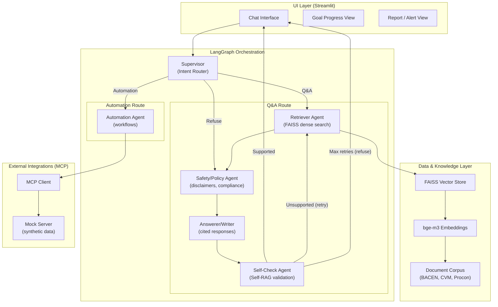

# 🪐 Órbita — Assistente Financeiro Agentico para Jovens Brasileiros

> **Prova de conceito acadêmica** de um sistema agentico multi-agente com RAG, orquestrado por LangGraph, conectado ao Open Finance Brasil via MCP (Pluggy), para educação financeira de jovens adultos brasileiros (sub-35).

[](https://www.python.org/)
[](https://github.com/langchain-ai/langgraph)
[](LICENSE)

---

## 📌 Visão Geral

**Problema:** 60% dos jovens brasileiros abandonam aplicativos de finanças pessoais. O mercado oferece dashboards passivos que exigem entrada manual de dados — exatamente o comportamento que os jovens evitam.

**Solução:** Órbita é um assistente financeiro agentico que:
- ✅ Responde perguntas de educação financeira com **citações de fontes oficiais** (BACEN, CVM)
- ✅ **Valida afirmações** com um mecanismo Self-RAG anti-alucinação
- ✅ **Automatiza** categorização de despesas, alertas de metas e geração de relatórios via Open Finance (Pluggy)
- ✅ **Zero entrada manual** — dados via Open Finance Brasil (MCP)

**Impacto Social:** Inclusão financeira para os 70M+ jovens brasileiros sem controle financeiro estruturado. Educação, não aconselhamento.

---

## 🏗️ Arquitetura

### Diagrama do Sistema



### Agentes

| Agente | Responsabilidade |
|---|---|
| **Supervisor** | Classifica intenção: Q&A, Automação ou Recusa |
| **Retriever** | Busca densa em FAISS com reranking opcional |
| **Safety/Policy** | Injeta disclaimers, bloqueia aconselhamento regulado |
| **Writer** | Gera resposta com citações `[Fonte: X, p.Y]` |
| **Self-Check** | Valida afirmações contra documentos recuperados (Self-RAG) |
| **Automation** | Executa workflows: categorizar, alertar metas, relatório |

### Fluxo Q&A

```
Usuário → Supervisor(qa) → Retriever(FAISS) → Safety → Writer → Self-Check
  → Se suportado: resposta com citações
  → Se não suportado + tentativas < 2: re-retrieval
  → Se não suportado + tentativas >= 2: recusa educada
```

### Fluxo de Automação

```
Usuário → Supervisor(automation) → Automation Agent
  → MCP Client (get_transactions/get_balances)
  → Categorização / Alerta de Meta / Relatório
  → Resultado formatado com disclaimer
```

---

## ⚙️ Setup

### Pré-requisitos

- Python 3.11+
- [Ollama](https://ollama.com/) instalado localmente
- [uv](https://docs.astral.sh/uv/) para gerenciamento de dependências

### 1. Clone e instale dependências

```bash
git clone <repo-url>
cd orbita

# Instala uv (se ainda não tiver)
curl -LsSf https://astral.sh/uv/install.sh | sh

# Cria virtualenv e instala todas as dependências
uv sync

# Para instalar dependências de dev (testes, linter)
uv sync --dev
```

### 2. Configure o ambiente

```bash
cp .env.example .env
# Edite .env conforme necessário (MCP_MOCK=true para modo demo)
```

### 3. Instale o modelo LLM

```bash
ollama pull llama3.1:8b
```

### 4. Execute o pipeline de ingestão (offline, uma vez)

```bash
uv run python -m ingest.pipeline
```

Isso irá:
- Baixar documentos do BACEN, CVM, Procon-SP, B3 (com fallback para corpus sintético)
- Segmentar em chunks de 512 tokens com 50 de sobreposição
- Indexar com embeddings `bge-m3` no FAISS
- Salvar o índice em `data/faiss_index/`

### 5. Execute o app

```bash
uv run streamlit run app/main.py
```

Acesse em: `http://localhost:8501`

### 6. Execute os testes

```bash
uv run pytest tests/ -v
```

> Os testes são totalmente mockados — não requerem Ollama ou internet.

---

## 🐳 Docker

```bash
# Build e execução
docker-compose up --build

# Puxar o modelo no primeiro uso
docker exec orbita-ollama-1 ollama pull llama3.1:8b

# Execute o pipeline de ingestão no container
docker exec orbita-orbita-1 python -m ingest.pipeline
```

---

## 🔌 MCP (Model Context Protocol) — Documentação de Segurança

### Servidor MCP Utilizado

- **Modo Demo (padrão):** `src/mcp/mock_server.py` — servidor MCP próprio com dados sintéticos brasileiros
- **Modo Produção:** Pluggy MCP Server (Open Finance Brasil) via `langchain-mcp-adapters`

### Ferramentas Expostas (tools)

| Tool | Descrição | Parâmetros |
|---|---|---|
| `get_transactions` | Busca transações bancárias por período | `start_date`, `end_date` (ISO date) |
| `get_balances` | Consulta saldos das contas vinculadas | — |
| `get_accounts` | Retorna metadados das contas | — |

### O que o agente **NÃO PODE** fazer via MCP

- ❌ Criar ou deletar transações
- ❌ Transferir fundos
- ❌ Criar pagamentos
- ❌ Autenticar ou obter credenciais
- ❌ Escrever dados no Open Finance
- ❌ Acessar dados fora do escopo (`data/` e `logs/`)

### Controles de Segurança

#### 1. Allowlist de ferramentas (`mcp_allowlist.yaml`)

```yaml
allowed_tools:
  - get_transactions
  - get_balances
  - get_accounts
```

Qualquer chamada a ferramenta fora dessa lista lança `PermissionError` e é registrada no log de auditoria.

#### 2. Log de auditoria (`logs/mcp_audit.log`)

Cada invocação de ferramenta MCP é registrada com:
- `timestamp` (ISO UTC)
- `tool` (nome da ferramenta)
- `params` (sem valores financeiros — redacted)
- `response_summary` (somente `record_count`, nunca valores)
- `blocked` (true/false)

**Exemplo de entrada no log:**
```json
{"timestamp": "2025-01-15T10:30:00Z", "tool": "get_transactions", "params": {"start_date": "2025-01-01", "end_date": "2025-01-31"}, "response_summary": "record_count=47", "blocked": false}
```

#### 3. Sanitização de saída MCP

Antes de qualquer dado do MCP chegar ao LLM:
- Caracteres de controle são removidos (prevenção de prompt injection)
- Campos longos são truncados em 256 caracteres
- Valores financeiros NUNCA são logados

#### 4. Justificativa de riscos (Supply-chain & Exfiltração)

| Risco | Severidade | Mitigação |
|---|---|---|
| **Supply-chain attack** via servidor MCP malicioso | Alta | Allowlist estrita; apenas operações de leitura; log de auditoria completo; Docker sandbox |
| **Prompt injection** via nomes de comerciantes | Média | Sanitização de controle chars; formato estruturado (não texto livre) |
| **Exfiltração de dados financeiros** | Alta | Valores nunca logados; dados não persistidos além do session state; `.env` excluído do git |
| **Aconselhamento financeiro não autorizado** | Alta | Safety agent bloqueia padrões regulados; disclaimer mandatório em toda resposta |

---

## 📊 Avaliação

### RAG — Métricas RAGAS

Execute: `python eval/run_ragas.py`

O golden set contém 15 perguntas rotuladas:
- 10 perguntas básicas de educação financeira (Tesouro Direto, CDI, FGTS, etc.)
- 3 perguntas adversariais (gatilhos de alucinação)
- 2 perguntas fora do escopo (devem ser recusadas)

| Métrica | Descrição | Meta |
|---|---|---|
| Faithfulness | Afirmações suportadas pelos docs recuperados | ≥ 0.70 |
| Answer Relevancy | Relevância da resposta para a pergunta | ≥ 0.70 |
| Context Precision | Precisão dos documentos recuperados | ≥ 0.65 |
| Context Recall | Cobertura dos documentos relevantes | ≥ 0.65 |
| Correct Refusals | Perguntas fora do escopo recusadas corretamente | = 2/2 |
| P50 Latency | Mediana de latência por pergunta | ≤ 30s |

> **Nota:** Métricas RAGAS requerem `pip install ragas`. Métricas básicas (refusals, citations, latency) funcionam sem RAGAS.

### Automação — 5 Tarefas de Avaliação

Execute: `python eval/run_automation_eval.py`

| ID | Tarefa | Critério |
|---|---|---|
| a01 | Categorizar 10 transações sintéticas | Todas as 7 categorias identificadas |
| a02 | Detectar desvio de meta (Reserva R$30k em 6 meses) | Alerta gerado para poupança insuficiente |
| a03 | Gerar relatório mensal de Janeiro 2025 | Período, sumário, insights e categorias presentes |
| a04 | Detectar gastos de lazer > 20% do salário | Flag de lazer gerado |
| a05 | Detectar 3 meses sem poupança | Nudge de intervenção gerado |

**Meta:** Taxa de sucesso ≥ 80% (4/5 tarefas)

---

## 🗂️ Estrutura do Repositório

```
orbita/
├── README.md
├── LICENSE                     # MIT
├── CITATION.cff
├── Dockerfile
├── docker-compose.yml
├── pyproject.toml
├── .env.example
├── mcp_allowlist.yaml
│
├── src/
│   ├── config.py               # Configuração centralizada
│   ├── agents/                 # 6 agentes LangGraph
│   ├── graph/                  # StateGraph + OrbitaState
│   ├── mcp/                    # Cliente MCP + segurança
│   └── rag/                    # Embeddings + FAISS + Reranker
│
├── app/
│   ├── main.py                 # Entry point Streamlit
│   ├── pages/                  # Chat, Metas, Relatórios
│   └── components/             # Citation + Disclaimer
│
├── ingest/
│   ├── pipeline.py             # Pipeline de ingestão offline
│   ├── loaders.py              # PDF + HTML loaders
│   ├── splitter.py             # Text chunking
│   └── sources.yaml            # Fontes BACEN/CVM/Procon/B3
│
├── eval/
│   ├── golden_set.json         # 15 Q&As rotuladas
│   ├── automation_tasks.json   # 5 tarefas de automação
│   ├── run_ragas.py            # Avaliação RAGAS
│   └── run_automation_eval.py  # Avaliação de automação
│
├── tests/
│   ├── conftest.py             # Fixtures mockadas
│   ├── test_supervisor.py
│   ├── test_retriever.py
│   ├── test_self_check.py
│   ├── test_automation.py
│   └── test_mcp_security.py
│
├── data/
│   ├── raw/                    # Documentos baixados
│   ├── processed/              # Chunks com metadados
│   └── faiss_index/            # Índice FAISS persistido
│
└── logs/
    └── mcp_audit.log           # Log de auditoria MCP
```

---

## 🛠️ Stack Técnica

| Componente | Tecnologia | Justificativa |
|---|---|---|
| Orquestração | LangGraph 0.2+ | Estado tipado, arestas condicionais, loop de retry Self-RAG |
| LLM | Ollama + Llama 3.1 8B | Zero custo, soberania de dados, sem API externa |
| Embeddings | BAAI/bge-m3 | Melhor modelo multilingual, suporte nativo a português |
| Vector Store | FAISS (faiss-cpu) | Zero dependência externa, persistência local, alta performance |
| MCP | langchain-mcp-adapters | Padrão de integração de ferramentas, plugável |
| UI | Streamlit 1.30+ | Controle de layout multi-tab, session state integrado |
| Avaliação | RAGAS | Métricas de RAG (Faithfulness, Relevancy, Precision, Recall) |
| Testes | pytest | Totalmente mockado, sem dependências externas |

---

## ⚠️ Limitações e Trabalho Futuro

### Limitações Atuais

1. **Qualidade do LLM em português:** Llama 3.1 8B pode ter desempenho variável em termos financeiros específicos
2. **Latência:** 2-3 chamadas de LLM por resposta = 20-30s no P50 (aceitável para PoC)
3. **Corpus:** Documentos sintéticos como fallback — corpus real requer execução do pipeline de ingestão
4. **MCP real:** Integração com Pluggy real requer credenciais de sandbox (demo usa mock)
5. **Avaliação RAGAS:** Com modelos locais, as métricas RAGAS podem ser menos precisas

### Trabalho Futuro

- [ ] Integração com Pluggy real (Open Finance Brasil)
- [ ] Busca híbrida (FAISS + BM25) para melhor recall em português
- [ ] Reranking com bge-reranker-v2-m3 (bonus B1)
- [ ] Suporte a múltiplos usuários
- [ ] Metas compartilhadas (casais/família)
- [ ] Agendamento de automações (background tasks)
- [ ] Integração com LangSmith para observabilidade

---

## 📄 Licença

MIT License — veja [LICENSE](LICENSE).

## 📖 Citação

```bibtex
@software{orbita2026,
  title = {Órbita: Agentic Financial Assistant for Brazilian Young Adults},
  year = {2026},
  license = {MIT},
  url = {https://github.com/orbita-project/orbita}
}
```

---

*Órbita é uma ferramenta educacional. Não constitui aconselhamento financeiro. Para decisões de investimento, consulte um profissional certificado pela CVM/ANBIMA.*
